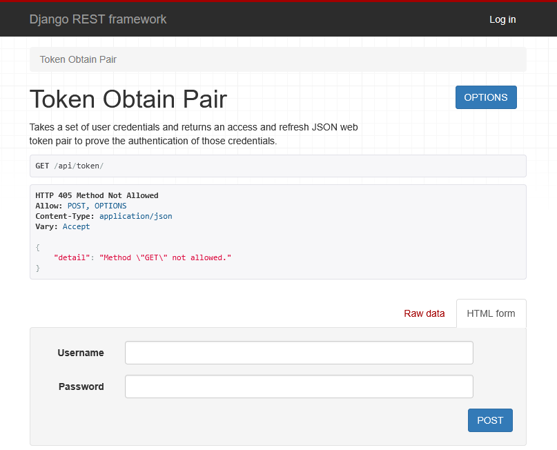

# Django React App

This repository contains a Django and React-based web application.

## Introduction

The Django React App is a web application built with Django with Django Rest Framework as the backend and React (using Vite) as the frontend library.

## Features

- Integration of Django with React
- User authentication (JWT)
- RESTful API with Django REST Framework
- Responsive design using React components

## Installation

To get started with the project, follow these steps:


1. **Install backend dependencies**:

    ```sh
    cd backend
    pip install -r requirements.txt
    cd ..
    ```

2. **Install frontend dependencies**:

    ```sh
    cd frontend
    npm install
    cd ..
    ```

3. **Apply database migrations**:

    ```sh
    python manage.py migrate
    ```

4. **Run the development server**:

    ```sh
    python manage.py runserver
    ```
   
5. **In another terminal, run frontend server**
    ```sh
    npm run dev
    ```

## Usage

After setting up the project, you can access the application by opening your browser and navigating to `http://localhost:5173/`, and you can start exploring the application.

The Django backend will serve the React frontend on  `http://localhost:8000`.

## Screenshot



